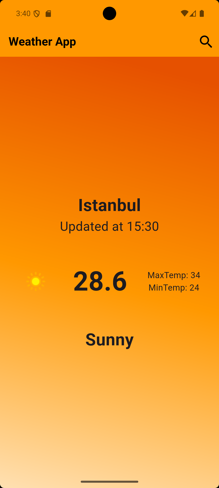
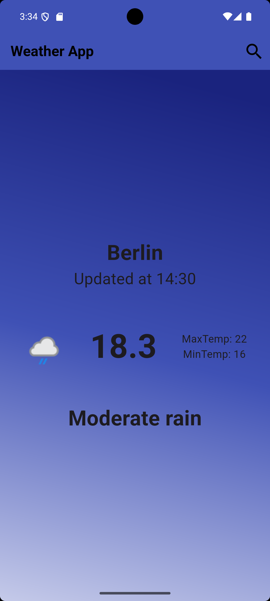
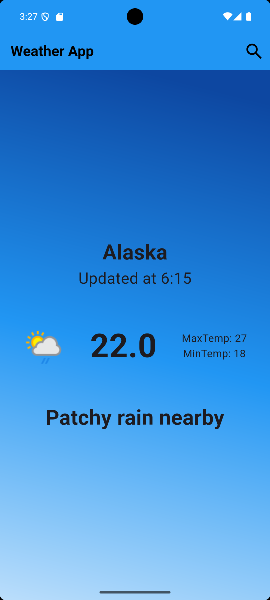

# 🌤️ Weather App - Flutter

A beautiful and interactive weather application built with **Flutter** and **Cubit (Bloc)** state management. The app allows users to search for any city and view real-time weather conditions with a dynamic UI that adapts to the weather state.

---

## 🚀 Features

- 🔍 Search for any city to get current weather details.
- 🎨 Dynamic UI that changes based on weather conditions (e.g., sunny, cloudy, rainy).
- ⚡ Real-time API integration using **WeatherAPI**.
- 🧠 Efficient state management using **Cubit**.
- 📱 Clean and responsive user interface.


---

## 📸 App Screenshots

<p align="center">
  
  
  
  
  
</p>


---


## 🛠️ Technologies Used

- **Flutter** 🐦  
- **Dart**  
- **Cubit (Bloc)** for state management  
- **Dio** for HTTP requests  
- **WeatherAPI** for weather data  

---

## 📂 Project Structure

```
lib/
├── cubit/            # Cubit logic and state files
├── models/           # Weather data models
├── services/         # API service for fetching weather data
├── views/            # UI components and screens
├── widgets/          # App widgets
├── main.dart         # App entry point
```

---


## 📝 How to Use

1. **Clone the repo**:
   ```bash
   git clone https://github.com/sahiralzakaria/Flutter-Learning-Apps-WeatherApp.git
   cd Flutter-Learning-Apps-WeatherApp
   ```

   
2. **Install dependencies**:
   ```bash
   flutter pub get
   ```

3. **Register and get your free API key**:
   - Go to [https://www.weatherapi.com/](https://www.weatherapi.com/)
   - Sign up and create an account
   - Generate your **API key**

4. **Add your API key**:
   - Open the file where the API key is defined (usually in `weather_service.dart`)
   - Replace the placeholder API key with your own:
     ```dart
     final String apiKey = 'YOUR_API_KEY_HERE';
     ```

5. **Run the app**:
   ```bash
   flutter run
   ```

---

## 📌 To Do

- Add support for weekly forecast  
- Add localization (multi-language support)  
- Improve error handling for network issues  

---

## 👨‍💻 Author

**Sahir Zakaria**

- 📧 Feel free to reach out for any questions or suggestions
- 🔗 Connect with me on social media
- ⭐ If you found this project helpful, please give it a star!


- [](https://github.com/sahiralzakaria) **GitHub:** [sahiralzakaria](https://github.com/sahiralzakaria)  
- [](https://www.linkedin.com/in/sahir-zakaria-39873531b) **LinkedIn:** [sahir-zakaria](https://www.linkedin.com/in/sahir-zakaria-39873531b)  
- [](mailto:sahir.alzakaria@gmail.com) **Email:** sahir.alzakaria@gmail.com

---

<div align="center">
  <p>Made with ❤️ by <strong>Sahir Zakaria</strong></p>
  <p><em>Happy Coding! 🚀</em></p>
</div>
